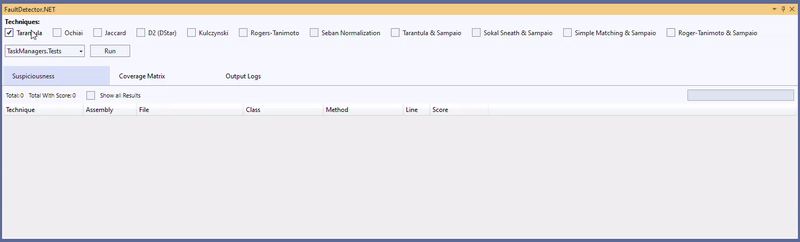
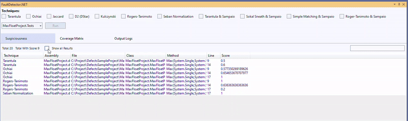
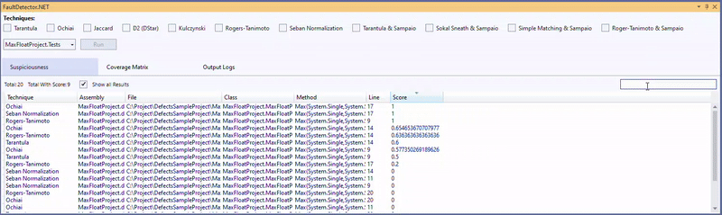
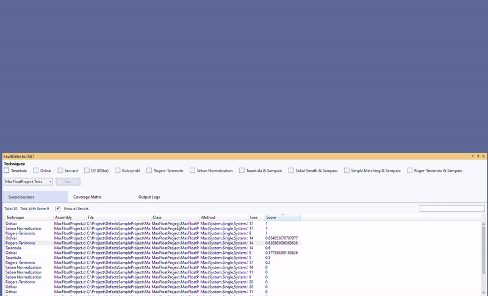
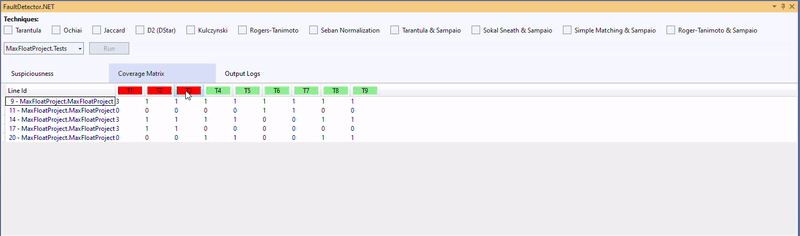
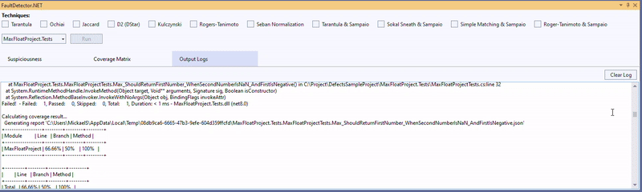

# FaultDetector.NET - Visual Studio Add-in

**FaultDetector.NET** is an automated fault localization tool designed for C# projects, integrated directly into Visual Studio 2022. This add-in helps developers identify potential fault locations in their code by analyzing test results and generating a ranking of suspicious code lines.

### Key Features:
- **Seamless Visual Studio Integration**: Fully integrated into Visual Studio 2022, allowing developers to interact directly within their familiar environment.
- **Multiple Fault Localization Techniques**: Supports a wide variety of spectrum-based fault localization techniques.
- **Coverage Matrix Visualization**: Displays a detailed matrix that highlights the coverage of each line of code during test execution.
- **Suspiciousness Ranking**: The tool provides a ranked list of the most suspicious lines of code based on the selected fault localization technique, helping to quickly pinpoint potential bugs.

### Installation

1. Open Visual Studio 2022.
2. Go to the menu `Extensions > Manage Extensions`.
3. Search for `FaultDetector.NET` in the search bar.
4. Install the extension and restart Visual Studio.

### Usage

1. **Open the Fault Detector Panel**: After installing the extension, go to the `View` menu and select `Show FaultDetector.NET Panel`. This will open the tool’s main interface.
2. **Select a Test Project**: In the panel, select the project you want to analyze from the dropdown menu.
3. **Choose Fault Localization Techniques**: You can choose from various fault localization techniques, including Tarantula, Ochiai, Jaccard, Seban Normalization, and more. Simply check the box next to the desired technique and click "Run."
4. **View Suspiciousness Scores**: Once the analysis is complete, a list of suspicious code lines will appear. These lines are ranked according to their likelihood of being faulty, based on the technique selected.

   
   
   
   

5. **Examine the Coverage Matrix**: Switch to the "Coverage Matrix" tab to see a visual representation of how each line of code was covered during test executions. This matrix helps you understand which tests executed specific lines of code.

   

6. **Output Logs**: The tool also provides detailed output logs, which can help you analyze how the tests were executed and locate any issues with the testing process.

   
