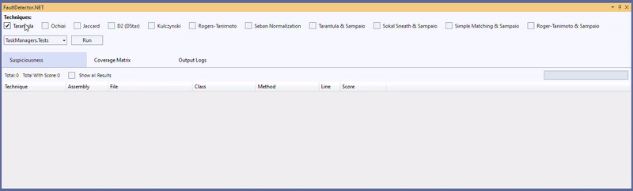
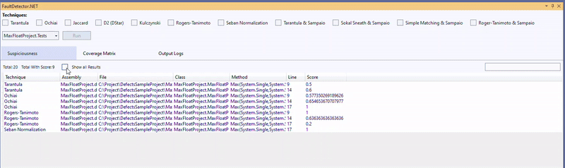
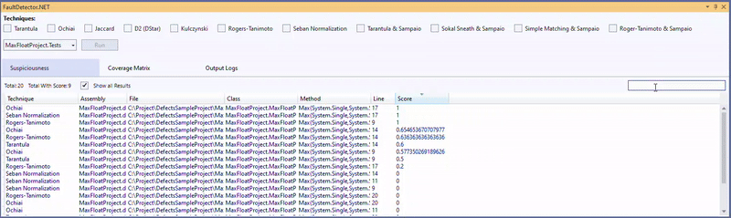
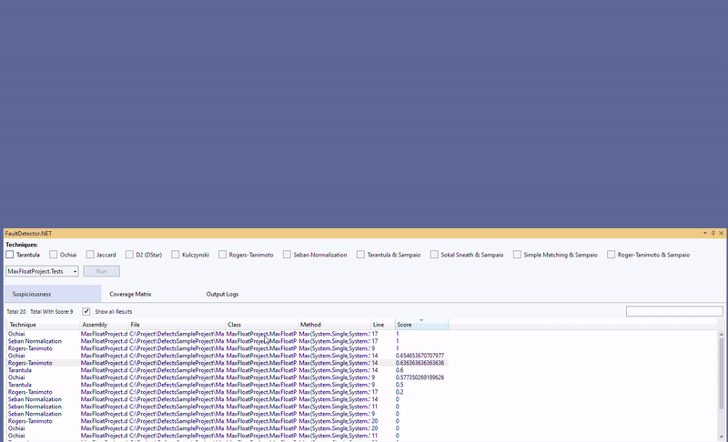
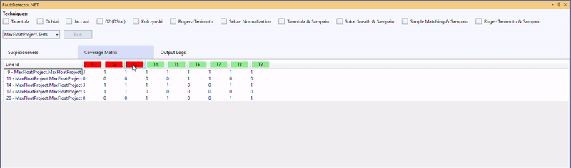
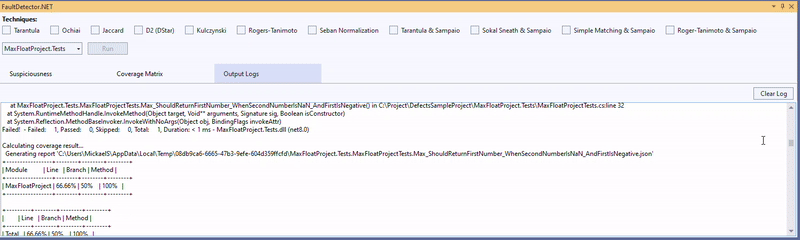
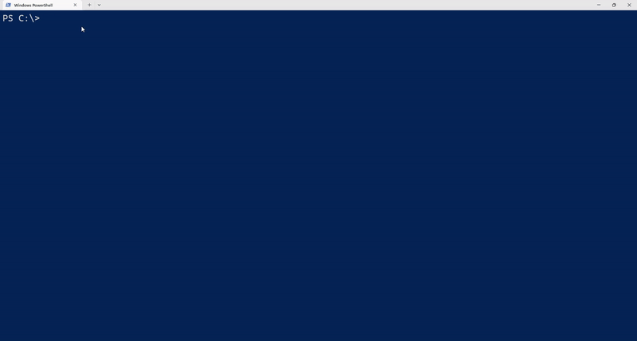
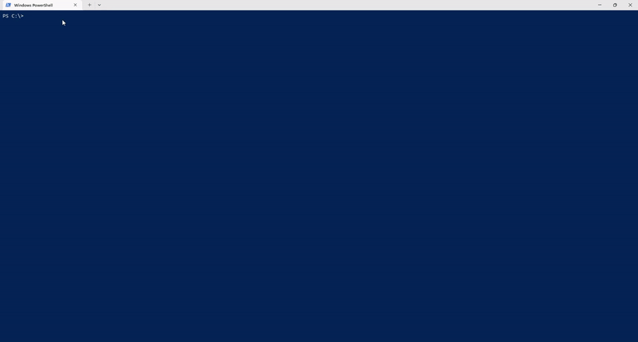

# FaultDetector.NET
 
**FaultDetector.NET** is an automated fault localization tool specifically designed for C# projects. It helps developers identify potential fault locations in their code by analyzing test results and generating a ranking of suspicious code lines based on various fault localization techniques.
 
The tool comes in two versions:
- A **Visual Studio Add-in**, for seamless integration into the Visual Studio IDE.
- A **Command-Line Interface (CLI)**, for integration into CI/CD pipelines or for use from the terminal.
 
## Key Features
- **Multiple Fault Localization Techniques**: Supports a variety of spectrum-based fault localization techniques such as Tarantula, Ochiai, Jaccard, and Seban Normalization.
- **Test Coverage Visualization**: Displays a detailed coverage matrix to show which lines of code are exercised by tests.
- **Ranking of Suspicious Lines**: Provides a ranked list of suspicious lines of code to help you locate the fault more quickly.
- **Support for C# Projects**: Tailored for C# developers, with special focus on integration within the Visual Studio environment.
 
---
 
## FaultDetector.NET Add-in
 
The **Visual Studio Add-in** allows developers to interact directly with FaultDetector.NET within their IDE. This version is particularly useful for developers who prefer a graphical interface and want real-time fault localization integrated into their development workflow.
 
### Installation

1. Open Visual Studio 2022.
2. Go to the menu `Extensions > Manage Extensions`.
3. Search for `FaultDetector.NET` in the search bar.
4. Install the extension and restart Visual Studio.

### Usage

1. **Open the Fault Detector Panel**: After installing the extension, go to the `View` menu and select `Show FaultDetector.NET Panel`. This will open the tool’s main interface.
2. **Select a Test Project**: In the panel, select the project you want to analyze from the dropdown menu.
3. **Choose Fault Localization Techniques**: You can choose from various fault localization techniques, including Tarantula, Ochiai, Jaccard, Seban Normalization, and more. Simply check the box next to the desired technique and click "Run."
4. **View Suspiciousness Scores**: Once the analysis is complete, a list of suspicious code lines will appear. These lines are ranked according to their likelihood of being faulty, based on the technique selected.

   
   
   
   

5. **Examine the Coverage Matrix**: Switch to the "Coverage Matrix" tab to see a visual representation of how each line of code was covered during test executions. This matrix helps you understand which tests executed specific lines of code.

   

6. **Output Logs**: The tool also provides detailed output logs, which can help you analyze how the tests were executed and locate any issues with the testing process.

   

---
 
## FaultDetector.NET CLI
 
The **Command-Line Interface (CLI)** version of FaultDetector.NET is designed for use in CI/CD pipelines or for developers who prefer using the terminal. It is especially useful for automated testing environments where the tool can be integrated into the build process.
 
### Installation
 
1. **Install the CLI version via NuGet**:
   ```
   dotnet tool install --global FaultDetector.CLI
   ```
   

### Usage

1. **Run Analysis with CLI**:
   ```
   faultdetector "C:\DefectsSampleProject\MaxFloatProject.Tests\MaxFloatProject.Tests.csproj" -e "C:\results" -t 1,2,3,4,6 -ssr
   ```
   
